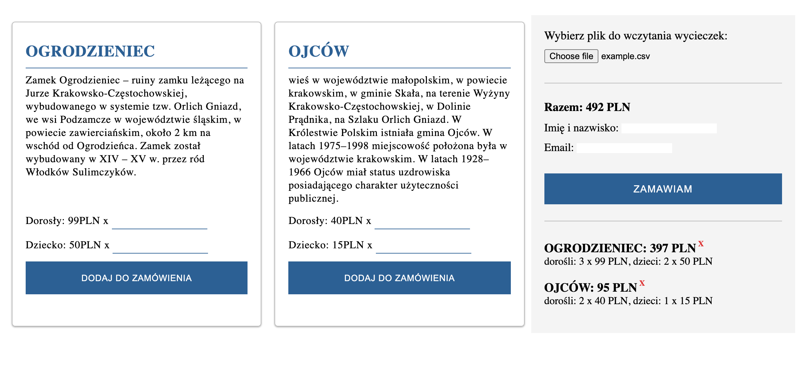
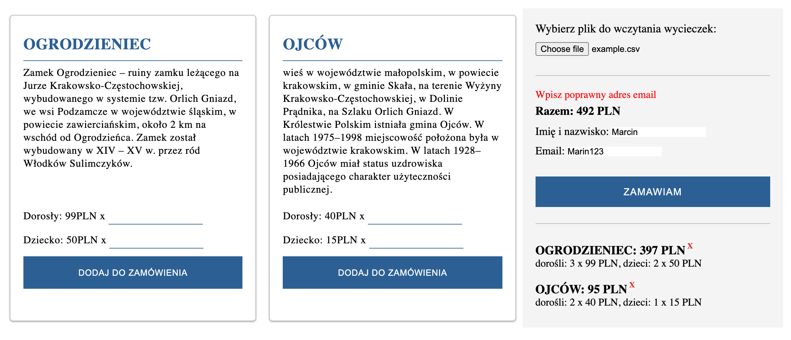

# JavaScript Form - Excursion Project

## About the project:
The aim of this project was create functionality like: load excursions form CSV file and presented them in a correct way, add a number of participants by client and show the summary, and posibility to make an order.

I had to plan all the functionality (from scratch using JavaScript) and decided what steps should I take to make it work. I got a very basic HTML and CSS (appearance was improve too) structure and CSV file with two excursion's example.

* Hypothetical client after loading a file, should get excursions with all detailes about them. I had to create the function to handle the file, split the data and remove unnecessary signs using regular expression.The file added to the project contains only two travel's options. However, the whole system can hold and present more data, as needed and required by a client.

* After choosing an excursion client can type the number of adults and children. Moreover, at this step I created functionality to check what kind of data was typed. If data isn't number or was empty, client see the information about the wrong value. If the value will be the number, client gets a summary of excursion: number of adults, childen and cost. Additionally, client can remove the excursion by clicking the sign "x", after that the total cost will be calculated.

* In the last step, client can order the excursions using an order form. In this step I also creted functionality to check what kind of data was typed. Name and last name should contains only characters. Email can be checked by using regular expression /^[-\w.]+@([-\w]+.)+[a-z]+$/i. If data is incorrect, client will get an alert what kind of data should be change. If data is fine, the order is finish and client will get the confirmation with information:
    * thank you for the order,
    * about total cost of the excursion,
    * that summary of the excursion was sent by email which was typed in order field


## How to use it
Please upload the example.csv file to see how it work. You can find the file attached to  this project.

## Technologies:
* JavaScript
* HTML
* CSS
* Desktop only version

## Links
* Live Site URL: [E.Kopacz JS Form Excursion Project](https://ekopacz-js-form-project.netlify.app)

## Solutions
By creating this project I had an opportunity to practice:
* creating code based on a few smaller functions
* creating and adding differents types of events
* creating functions to check if data in inputs is correct before sending the form
* adding data to existing HTML structure from CSV file
* how to bind event listeners to dynamically-created elements in JavaScript
* how to add CSV file to the website and how to using FileReader() object

I had opportunity to learn regular expression, for example: how to use regular expression to split data in columns. See the code below:

```
function splitDataAsColumns(file){
    const columnData = [];
    const regExp = new RegExp(",(?=(?:[^\"]*\"[^\"]*\")*(?![^\"]*\"))");
    for (let i=0; i<file.length; i++) {
        const splitLine = file[i].split(regExp);
        const splitItem = [];
            for (let j=0; j<splitLine.length; j++) {
                splitItem.push(splitLine[j].replace(/^"|"$/g, ''));
                }
        columnData.push(splitItem);
    }
    createNewExcursion(columnData);
}
```

FileReader() object:

```
function handleText(file){
    if(file){
        const reader = new FileReader();
        reader.readAsText(file, 'UTF-8');
        reader.onload = handleLoad;
    }
    else{
        alert('Plik nie został wybrany');
    }
}
```
### Project preview
Added excursions to the summary


Order form validation


### Feel free to contact me:
* [Linkedin](https://www.linkedin.com/in/ewelina-kopacz-929559100/) - Ewelina Kopacz

### Sources:
* [Typeofnan.dev](https://typeofnan.dev/how-to-bind-event-listeners-on-dynamically-created-elements-in-javascript/) - event listeners to dynamically-created elements in JavaScript
* [Codegrepper.com](https://www.codegrepper.com/code-examples/javascript/REMOVE+all+children+from+div+javascript) - how to remove all children
* [Pretagteam.com](https://pretagteam.com/question/remove-quotes-from-array-javascript) - how to remove quotes from array using regular expressions
* [Web Dev Simplified](https://www.youtube.com/watch?v=rhzKDrUiJVk&t=113s) - amaizing video about regular expressions


### Thanks for project and support to Mateusz Bogolubow:
* Mentor i Trener Programowania JavaScript - [DevMentor](https://devmentor.pl/) - Mateusz Bogolubow